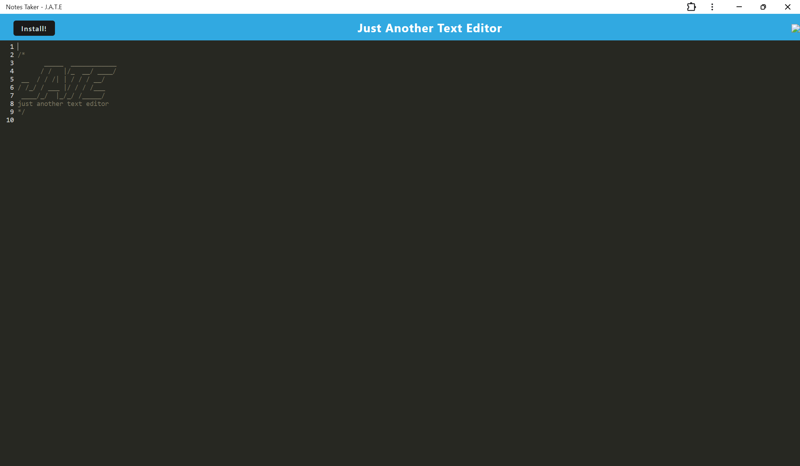

 # Just Another Text Editor PWA

## Table of Contents

-[Description](#description)

-[Installation](#installation)

-[Usage](#usage)

-[Credits](#credits)

-[Testing](#testing)

-[License](#license)

-[How to Contribute](#how-to-contribute)

### Description

This project was to show that I can take an already created website and make it into a Progressive Web App. A Progressive Web is an offline web app which is an exact copy of the website. Making this text editor a PWA shows future employers that I can make a PWA and still have it be functional.

### Installation

Type "npm i" in order to install Webpack, babel, concurrently, node and other packages used in making this application.

### Usage

The intended usage for this project is to edit any text you may have. It is used similar to Word or Google Docs

### Credits

Thank you to Erik Hirsh and Andrew Hardemon for helping me troubleshoot display errors due to Webpack being extremely picky.

### Testing

The testing used in this application was mainly checking the console and going through any errors that popped up.

### License

MIT: https://opensource.org/license/mit

### How to Contribute

If there is anything I can do to improve the webpage, please contatc me via Linkedin: https://www.linkedin.com/in/jessica-clark-777156296/
